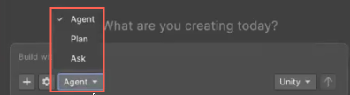

# Assistant modes and model tiers

Choose from different modes and model tiers to customize how Assistant responds to your prompts and interacts with your project. Each mode provides a different level of interaction, from read-only guidance to direct project changes.

## Assistant modes

Assistant supports three interaction modes for different workflows:

- **Ask** mode provides explanations, guidance, and project insights using read-only tools. It doesn't modify your scene or assets.
- **Plan** mode generates a step-by-step plan for a complex task. You can review the plan and approve it before implementation in Agent mode.
- **Agent** mode performs actions directly in your project, such as creating objects or modifying assets. All modifying actions require your approval and respect your permission settings.

Choose the mode that matches the level of action you want Assistant to take. Use **Ask** mode for explanations, **Plan** mode to review larger workflows before implementation, and **Agent** mode for direct project changes.

### Comparison of Assistant modes

The following table compares the three Assistant modes:

| Feature | Ask mode | Plan mode | Agent mode |
| ------- | -------- | ------- | ------ |
| Primary purpose | Provide explanations and guidance | Create and review implementation plans | Perform actions in the project |
| Modifies scenes or assets | No | No, until approved | Yes |
| Tool access | Read-only | Read-only during planning | Read and write |
| Saves plans to project | No | Yes | No |
| Requires approval before implementation | Not required for read actions | Yes | Based on permissions |
| Best for | Learning, reviewing | Complex workflows | Direct changes - setup, fixes, and automation |
| Example prompt | `How do I create a weapon system?` | `Create a weapon system for my game.` | `Add a weapon system to my game.` |

### Ask mode

Use the **Ask** mode for questions and explanations.

In this mode, Assistant:

- Answers questions in text.
- Suggests code, settings, and best practices.
- Uses read-only tools to inspect your project.
- Doesn't call tools that modify your scene or assets.

Assistant in **Ask** mode doesn't perform write operations, so it doesn't request confirmation to make changes. However, it still respects your read permissions. If read access to a specific operation is blocked in your [permission settings](xref:preferences#enable-autorun), Assistant can't inspect that information.

For example, in **Ask** mode:

- `How should I create a cube for this scene?`: Assistant describes the steps or shows example code, but doesn't create the cube.
- `What is a good light intensity for this scene?`: Assistant reads the current scene data and suggests settings without changing values.

### Plan mode

Use [Plan mode](xref:assistant-plan-mode) when you want Assistant to generate and save a structured implementation plan before it makes changes.

In this mode, Assistant:

- Uses read-only tools to inspect project context.
- Generates a step-by-step implementation plan.
- Lets you review and revise the plan before implementation.

After you approve the plan, Assistant switches to **Agent mode** and implements the approved steps.

Use **Plan** mode for larger tasks that benefit from planning and review, such as creating gameplay systems, building new features, or implementing multi-step workflows.

### Agent mode

Use **Agent** mode to perform actions in your project. In this mode, Assistant:

- Calls tools that can create, modify, or delete objects.
- Uses your permission settings to decide when to prompt for confirmation.
- Combines reasoning and tool calls to complete multi-step tasks.

For example, in the **Agent** mode:

- `Create a cube in my scene.`: Assistant calls a tool, such as `Create GameObject`, asks for permission if required, and creates the cube.
- `Fix the light intensity in this scene.`: Assistant reads the scene data, then calls tools to adjust lights if you grant permission.

Assistant in **Agent** mode still answers questions with text only, especially when no action is required. However, it always has access to a broader set of tools than the **Ask** mode, and acts when your prompt implies a change.

## Model tiers and capabilities

The model tier you select affects the quality, depth, and latency of Assistant's responses. Unity AI Assistant provides three model tiers you can choose from:

- **Unity Default** is the standard tier. It provides a balance of speed and capability suitable for most workflows.
- **Unity Lite** is a low-latency option. Use it for everyday tasks, such as scripting, minor modifications, and standard generation.
- **Unity Ultra** is a higher-capability option. Use it for complex, multi-step, or ambiguous tasks where output quality matters most. It takes longer to process but delivers more thorough results.

> [!NOTE]
> **Unity Ultra** costs significantly more [credits](https://docs.unity.com/en-us/ai/credits/credits-about) than **Unity Default** and **Unity Lite**, so use it only for complex or ambiguous tasks requiring deeper reasoning. If Ultra capacity is unavailable, your task automatically falls back to **Unity Default**.

## Additional resources

* [Create implementation plans](xref:assistant-plan-mode)
* [Use images and screenshots](xref:image-support)
* [Use Assistant tools](xref:assistant-tools)
