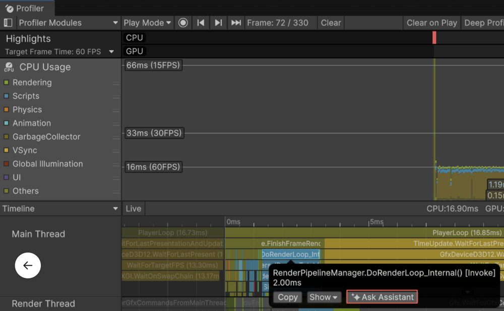

# Analyze a Unity Profiler capture

Use Assistant to analyze specific profiling samples directly from the Profiler window.

> [!IMPORTANT]
> This feature requires Unity 6.4 or later.

Use this workflow when you're already inspecting profiling data and want explanations or optimization guidance for a specific frame, sample, or timeline entry.

Before you start, make sure you meet the following prerequisites:

- A saved or active profiling session is available in the Profiler.
- Assistant is enabled in the Unity Editor.

To ask Assistant about profiler data, follow these steps:

1. Open the **Profiler** window in the Unity Editor.
1. Load a saved profiling session or record a new one.
1. Change to a supported view, such as **Timeline**.
1. Select a profiler sample or frame.
1. Select **Ask Assistant**.

   A prompt appears with a suggested question based on the selected sample. You can edit this prompt before submitting it. The selected profiling data is automatically attached.

   

2. Submit the prompt.

   The analysis appears in the Assistant window.

3. Review the results, select other samples, or refine your question to explore performance issues in more detail.

## Additional resources

* [Analyze profiler data in Assistant](xref:analyze-performance-assistant)
* [Highlights Profiler module reference](https://docs.unity3d.com/6000.5/Documentation/Manual/ProfilerHighlights.html)
* [CPU Usage Profiler module introduction](https://docs.unity3d.com/6000.5/Documentation/Manual/profiler-cpu-introduction.html)