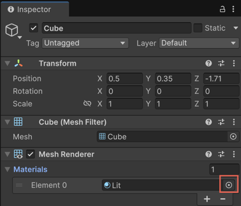
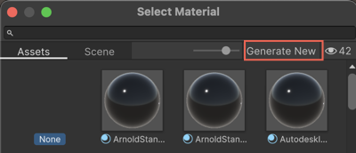

# Assign generated assets with the Object Picker

Use the Object Picker to create a new asset. It provides a starting point if you don't have pre-created assets. The Object Picker is available across all Generators.

When you use the Object Picker, it opens the appropriate Generator window based on the type of asset you're creating. For example, to change the material of a GameObject, use the Object Picker in the **Material** section of the **Inspector** window. This opens the Material Generator.

To create and assign a new asset, follow these steps:

1. In the **Inspector** window, select the Object Picker (⊙) icon next to the relevant field. For example, **Material** or **Sound Reference**.

    

2. Select **Generate New** in the top-right corner.

    

   The appropriate Generator window opens based on the selected field.
3. Enter a prompt, adjust the settings, and select **Generate**.

   For more information, refer to [Create a sprite from a prompt](xref:generate-sprite).

When generation is complete, the new asset is:
* Added to your project
* Automatically assigned to the original field from which you started

## Example: Generate and apply a new material

To modify the material of a 3D object, follow these steps:

1. Select the object in the **Hierarchy** tab.
1. In the **Inspector** window, locate the **Material** section.
1. Select the Object Picker (⊙) icon.
1. Select **Generate New** to create a material.
1. In the Generator window, enter a prompt. For example, `marble floor`.
1. Adjust any other settings as needed.
1. Select **Generate**.

   The generated material is added to your project and automatically applied to the object.

## Additional resources

* [Create a sprite from a prompt](xref:generate-sprite)
* [Create a Texture2D asset from a prompt](xref:generate-texture2d)
* [Create a sound clip from a prompt](xref:sound-prompt)
* [Create a material from a prompt](xref:material-generate-prompt)