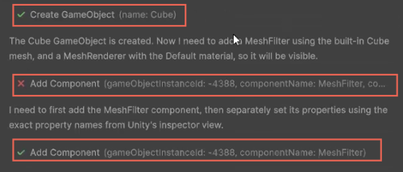

# Use Assistant tools

Understand how Assistant uses Unity tools to read and modify your project.

Assistant uses a large language model (LLM) to interpret your prompts, but it can't act in your project on its own. To read data or make changes in the Unity Editor, Assistant relies on predefined Unity tools. When Assistant needs to perform an operation, such as create a GameObject, inspect an asset, or change a setting, it selects and calls one of these tools.

The **Assistant** window indicates when a tool is called and what result it produces. By understanding how tools work, you can better interpret Assistant responses, review what actions were taken, and decide when it's appropriate to grant permissions.

When Assistant calls a tool, the conversation displays a tool entry with an icon (tick or cross). This icon indicates that a Unity function ran as part of the response.

You can expand a tool entry to review details such as:

- The name of the tool that was called.
- The parameters that Assistant passed to the tool.
- The result of the call, including success messages or error output.

For example, when Assistant creates a cube, the tool result confirms that the object was created successfully. If a tool call fails, the expanded view shows the error message so that you can understand what went wrong and adjust your prompt if needed.

## Read-only tools and modifying tools

Assistant tools fall into two main categories:

* Read-only tools: These tools inspect your project but don't change it. They might:

   - Read object values in the scene.
   - Fetch built-in assets.
   - Inspect project structure.

* Modifying tools: These tools change your project. They might:

   - Create or delete GameObjects.
   - Add or remove components.
   - Update asset or object settings.

Your [permission settings](xref:preferences#enable-autorun) control whether Assistant can call tools that modify your project.

## Additional resources

* [Assistant modes and model tiers](xref:assistant-modes)
* [Configure Assistant permissions and preferences](xref:preferences)
* [Assistant interface](xref:assistant-interface)