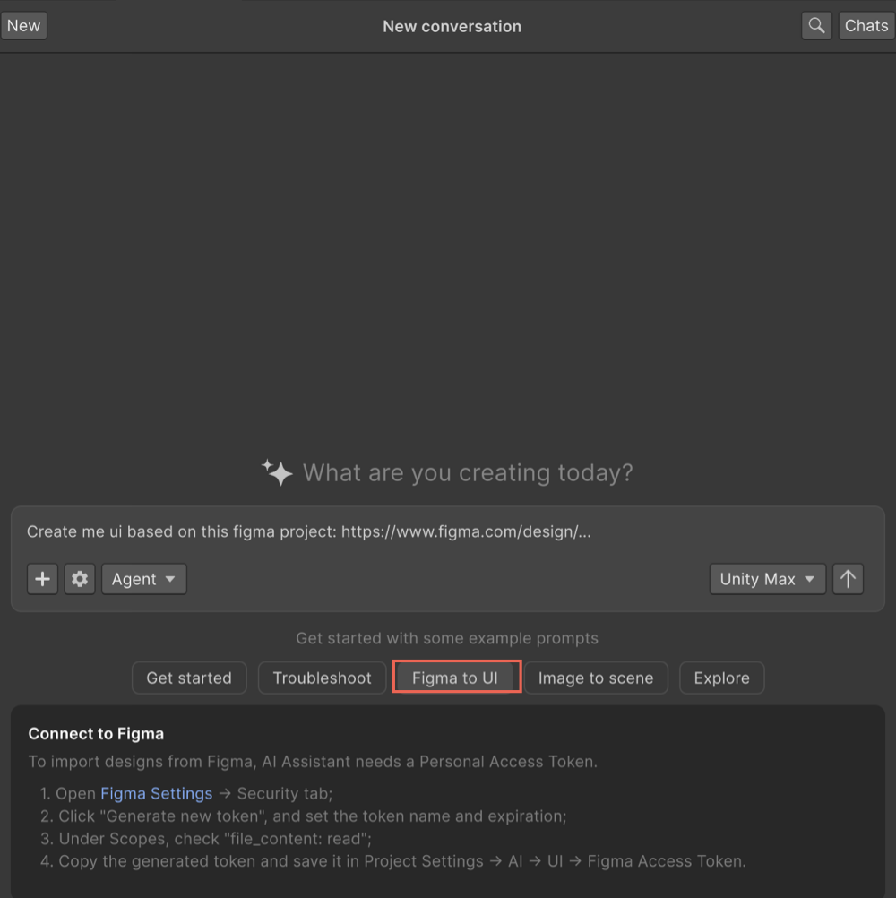

# Create UI from a Figma design

Generate Unity UI assets from a Figma design when you connect your Figma project to Assistant through a Figma project link.

Assistant can import design data from a Figma project, extract the relevant image assets and screen references, and generate Unity UI with the UI framework of your choice. This speeds up UI authoring and converts Figma mock-ups into Unity UI assets directly inside the Unity Editor.

Before you generate UI from Figma, [create a Figma personal access token and save it in the Unity Editor **Project Settings**](#connect-assistant-to-figma). For more information, refer to [UI Authoring settings reference](xref:figma-ui-reference).

After setup, you can [provide a Figma project link in Assistant](#generate-ui-from-a-figma-project) and ask it to create a screen from the design.

## Prerequisites

Before you begin:

1. Install and open **Assistant** in the **Unity Editor**.
2. Have access to the Figma project you want to use.
3. Have permission to generate a personal access token in Figma.

## Connect Assistant to Figma

Before Assistant can import designs from Figma, generate a Figma personal access token and save it in the Unity Editor.

To connect Assistant to Figma:

1. Open the Figma personal access token settings using one of the following methods:

   - If you're in the Unity Editor:

     1. Open the **Assistant** window.
     2. Select **Figma to UI**.

        

     3. In the **Connect to Figma** section, select the **Figma Settings** link.

   - If you're in Figma:

     1. Select the **Main menu** icon.
     2. Select **Help and account** > **Account settings**.

2. On the Figma **Account** page, select **Security**.
3. In the **Personal access tokens** section, select **Generate new token**.
4. Enter a name for the token.
5. Set the token **Expiration**.
6. In the **Files** section, enable **file_content:read**.
7. Select **Generate token**.
8. Copy the generated token.
9. In the Unity Editor, open **Edit** > **Project Settings** > **AI** > **UI**.
10. Paste the token into **Figma Access Token**.
11. Select **Verify & Save**.

After the token is verified, Assistant can access your Figma project links.

## Generate UI from a Figma project

After you connect Assistant to Figma, provide a Figma project link in Assistant to generate UI assets. You can use your own Figma project or a public community design.

To generate UI from a Figma design:

1. Open the **Assistant** window.
2. Enter a prompt that includes your Figma project link. For example, `Recreate UI from my Figma project: <Figma project link>`.
3. Submit the prompt.

Assistant analyzes the Figma project link. If it points to a specific screen, Assistant generates that screen directly. If it points to a project with multiple screens, Assistant asks you to select which screen to recreate.

## Review generated UI assets

When Assistant processes the Figma project, it imports the referenced design assets and generates Unity UI files in your project's `Assets` folder.

To review the generated files:

1. In the **Project** window, open the `Assets` folder.
2. Locate the folder created for the imported Figma design.
3. Review the generated UI files.

Assistant imports:

- Image assets from the Figma design.
- A reference image of the selected screen.

It also generates the UI layout files for the selected UI framework, such as `.uxml` and related assets for UI Toolkit.

Assistant summarizes the generated output in the Assistant conversation so you can identify which files were created.

## Additional resources

- [UI Authoring settings reference](xref:figma-ui-reference)
- [Create assets in Unity Editor](xref:use-generators-assistant)
- [Use Assistant tools](xref:assistant-tools)