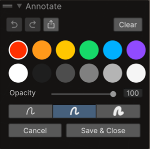

# Annotate screenshots for Assistant questions

Capture a screenshot, annotate it, and attach it to your Assistant conversation so that Assistant can understand what you’re referring to.

The Annotation tool helps you describe a specific area of the Unity Editor, point to an object in the Scene view, or clarify what a script, GameObject, or UI element does. When you draw directly on the Unity Editor or your full desktop, you can highlight exactly what you mean and get relevant answers.

Before you start, make sure you open the following:

- **Assistant** window
- Unity project and Editor view you want to capture

## Capture and annotate a screenshot

You can capture screenshots in two ways, depending on whether you want the entire screen or only the Unity Editor.

### Take a screenshot of your entire screen (and open Annotate)

To take a screenshot of your entire screen and immediately start annotating, follow these steps:

1. In the **Assistant** window, select Add (**+**).
2. Select the pencil icon.

   The screenshot opens in the **Edit Screen Capture** window.

3. Draw on the screenshot to highlight what you want to ask about.
4. (Optional) In the **Annotate** window, adjust the annotation settings:

    

   - Select the undo or redo buttons to revert or restore your last annotation changes.
   - Select the export button to save the screenshot locally.
   - Select **Clear** to remove the annotations you added in the current session.
   - Select a color for the brush.
   - Select a brush size.
   - Adjust the opacity of the brush using the **Opacity** slider (20% - 100%) to control the transparency of your annotations.

5. Select **Save & Close** to attach the annotated screenshot to your Assistant message.
6. Enter your question in the Assistant prompt and submit it.

When you save, Assistant attaches the screenshot with your annotations merged into the image.

## Take a screenshot of only the Unity Editor (then open Annotate)

This workflow is useful if you don’t want external content captured in your screenshot, such as file explorer windows or other desktop applications.

To capture only the Unity Editor windows (instead of your entire screen), follow these steps:

1. In the **Assistant** window, select Add (**+**).
2. Select the camera icon to take a screenshot of the Unity Editor.
3. In the Assistant attachments area, double-click the screenshot thumbnail to open it in the **Edit Screen Capture** window.
4. Draw on the screenshot to highlight what you want to ask about.
5. Select **Save & Close** to attach the annotated screenshot to your Assistant message.
6. Enter your question in the Assistant prompt and submit it.

When you finish, Assistant attaches the annotated screenshot to your message and can use it to answer questions about what you highlighted.

## Additional resources

* [Create and restore checkpoints](xref:checkpoints)
* [Manage Assistant](xref:manage-assistant)