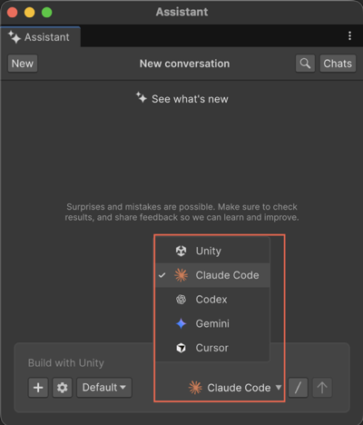

# Configure AI Gateway

Set up a third-party agent and add credentials so Assistant can route prompts to your preferred provider.

After you connect an agent and add its API key, you can change agents in the **Assistant** window and use provider-specific models and commands.

## Prerequisites

Before you start, make sure you meet the following prerequisites:

- Install the Assistant package and open your project in the Unity Editor.
- Decide which agent you want to use. For example, Claude Code, Gemini, or Codex.
- Check the agent prerequisites on your operating system (OS). For example, Claude Code on Windows requires Git Bash.
- Get an API key from the provider’s account portal.

### Access requirements

AI Gateway and MCP access require an eligible Unity subscription and an assigned seat.

Before you configure AI Gateway, make sure that:

- Your Unity organization has a supported subscription that includes AI Gateway or MCP access.
- An administrator has assigned you a seat for the subscription.
- You link your Unity project to the same organization where your seat is assigned.

> [!NOTE]
> AI Assistant credits don't require seat assignment. However, AI Gateway and MCP features require an explicitly assigned seat.

### Supported agent versions

AI Gateway supports the following agents and versions:

- **Claude Code**: 2.1.45 or later
- **Cursor CLI**: 2026.02.13 or later
- **Codex CLI and Gemini CLI**:  Unity provides bundled versions. You can't choose which version AI Gateway uses.

## Assign a Gateway or MCP seat

If you don't have access to AI Gateway or MCP features, ask your organization administrator to assign you a seat.

To assign a seat, follow these steps:

1. Go to Unity Dashboard > **Administration** > **Subscriptions**.
2. Select the relevant AI, Unity Pro, Enterprise, or Industry subscription.
3. Select **Assign Seats**.
4. Select the users who require AI Gateway or MCP access.

After the seat is assigned, make sure your Unity project is linked to the same organization.

## Onboard an agent from Assistant

Use the agent selector in Assistant to detect or install an agent.

To select and install an agent, follow these steps:

1. Open the **Assistant** window in the Unity Editor.
2. From the agent selector list, select the agent you want to use. For example, **Claude Code**.

   

3. If the agent isn't found, Assistant displays a banner with a link to install the agent from internet.
4. Follow the instructions to install the agent.
5. After the agent is installed, do one of the following:

   - Add your API key in the AI Gateway installer window and select **Save**.

   - [Add your API key through the **Gateway** window](#add-the-api-key).

After the installer finishes, the agent is available in the Assistant agent selector. To choose models or use provider‑specific commands, refer to [Use third‑party agents in Assistant](xref:use-third-party-agents).

### Add the API key

Follow the instructions in this section to provide credentials after you install an agent, or when you change to an agent with missing credentials.

To add the API key, follow these steps:

1. When Assistant prompts you for missing credentials, select the link to open the **Gateway** window.

   In the Unity Editor, you can also select **Project Settings** > **AI** > **Gateway**.

   The **Gateway** page opens.

2. From the **Agent Type** list, select the agent you want to use for your project. For example, **Claude Code**.
3. (Optional) If **CLI Path** is empty, select **Browse** and locate the agent’s executable on your machine.
4. To add environment variables, follow these steps:

   1. Expand **Environment Variables**.
   2. Select **Add Variable**.
   3. Enter the variables your agent needs. For example:
      - Claude Code: `ANTHROPIC_API_KEY`
      - Gemini CLI: `GEMINI_API_KEY`
   4. Use the user interface (UI) controls to enable, disable, or delete a variable.

   Assistant reloads the agent and resumes your session.

After you complete these steps, Assistant routes new prompts to the selected agent. If a banner appears stating that credentials are missing, return to the **Gateway** window to verify your settings.

## Additional resources

- [AI Gateway overview](xref:ai-gateway-intro)
- [Use third-party agents in Assistant](xref:use-third-party-agents)