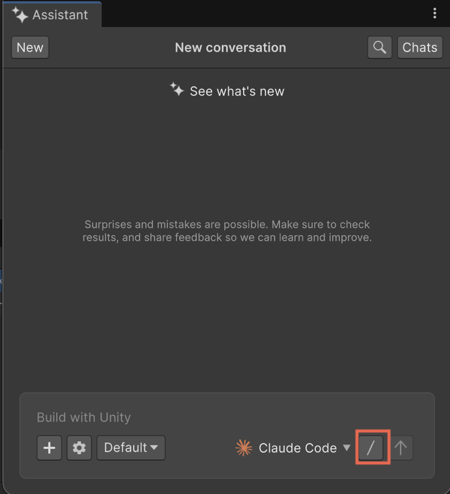

# Use third‑party agents in Assistant

Change agents, choose models, and run provider‑specific commands in the Assistant conversation.

After you install and authenticate third-party agents, you can change agents, select a model exposed by an agent, and use its slash commands within the Unity Editor.

For initial setup and credentials, refer to [Configure AI Gateway](xref:ai-gateway-get-started).

## Prerequisites

Before you start, make sure you meet the following prerequisites:

- Install or detect at least one agent through Assistant.
- Add the agent's API key in the **Gateway** window.

To work with agents in Assistant, follow these steps:

1. Open the **Assistant** window.
2. Select the agent selector and choose the agent you want to use.

   The default agent is **Unity**.

   If the agent isn’t installed or credentials are missing, use the banner link to [install the agent or enter your API key](xref:ai-gateway-get-started).

   If AI Gateway or MCP features aren't available after setup, verify that:

   - Your organization subscription includes AI Gateway or MCP access.
   - A seat has been assigned to your Unity account.
   - Your project is linked to the correct organization.

3. Select the forward slash (**/**) button to open the model picker and slash menu.

   

4. Select a model provided by the agent.

   Available models vary by agent.

5. (Optional) From the slash (`/`) menu, select a command. For example, **/review** or **/init**.

   You can also type the command directly in the text field. For example, `/review`.

   Command availability and behavior vary by agent.

6. Submit your query.

When you send a message, Assistant routes it to the selected agent and displays the results in the same conversation.

## Additional resources

- [Work with Assistant](xref:get-started)
- [AI Gateway](xref:ai-gateway-landing)