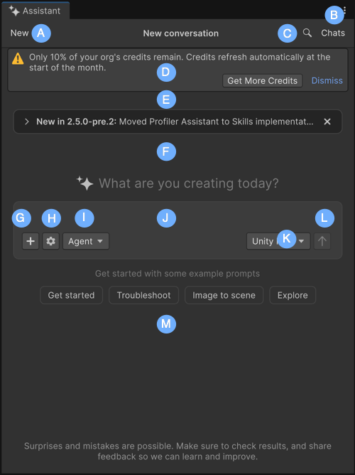

# Assistant interface

This section provides a detailed tour of Assistant.

| Component | Description |
| --------- | ----------- |
| **A**: **New** | Start a new conversation with Assistant or reset the current chat context. |
| **B**: **Chats** | Review and reuse previous information without having to retype or recall past conversations. |
| **C**: Search (magnifying glass) | Search across the current Assistant conversation to quickly find previous prompts and responses. |
| **D**: Low credits banner | Display the remaining balance. It appears when your organization is running low on usage credits. Select the link in the banner to request a credits top-up or **Dismiss** to hide the banner temporarily. |
| **E**: See what’s new | Read the latest updates and release highlights for Assistant. |
| **F**: Conversation area | Displays your prompts, Assistant responses, **Reasoning** section, and tool results. |
| **G**: Attach (**+**) | Attach supported project data to your prompt. For example, GameObjects, assets, scripts, Console messages, screenshots, and other supported project data. |
| **H**: **Settings** menu (gear icon) | Open the prompt settings menu, where you can enable **Autorun**, enable or disable **Collapse Reasoning when complete**, view **Permission Overrides**, open **Assistant Settings**, or refresh the project overview. |
| **I**: Mode selector (**Ask**/**Plan**/**Agent**) |
| **J**: Text field | Enter your prompt. A prompt is the primary way to interact with Assistant. By typing in questions, instructions, or topics of interest, you start the conversation and receive relevant responses from Assistant.  |
| **K**: Agent selector | Select the active provider or coding agent for the current conversation. When you enable AI Gateway, this menu lists Unity and any configured third-party agents, such as Claude Code, Codex, Gemini, or Cursor. Assistant routes your prompts to the selected agent. |
| **L**: Submit (arrow) | Send your prompts to Assistant. |
| **M**: Example prompt buttons | Quickstart suggestions (such as **Get started**, **Troubleshoot**, **Image to scene**, and **Explore**) that appear on the Assistant window. Select any button to populate your query with a suggested prompt and start your conversation with Assistant. |

## Additional resources

* [Configure Assistant permissions and preferences](xref:preferences)
* [Best practices for using Assistant](xref:assistant-best)