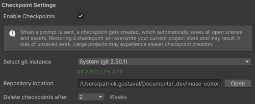

# Checkpoints reference

Explore the checkpoints-related properties and settings in Assistant.

## Checkpoints settings

You can view and manage checkpoints in **Preferences** > **AI** > **Assistant**.

| Settings | Description |
| ------- | ----------- |
| **Enable Checkpoints** | Turns checkpoint creation on or off for Assistant. When enabled, Assistant automatically creates Git snapshots of your project each time you send a prompt. This allows you to restore your project to an earlier state. When disabled, Unity doesn’t create checkpoints before Assistant prompts. |
| **Select git instance** | Displays the Git installation that Unity uses to store temporary checkpoints data. The available options include **System** (a Git version installed at the operating system level) and **Custom** (lets you specify a path to a different Git installation).|
| **Repository location** | Shows where Unity stores the local repository used for checkpoints. Unity stores this repository outside your project files on your local machine. |
| **Delete checkpoints after** | Controls how long Unity keeps the checkpoint commits before it deletes them automatically. The available options include **1** week or **2** weeks. |

These settings help limit disk usage and ensure checkpoints remain a short-term recovery feature rather than a long-term source control system.

## Additional resources

* [Create and restore checkpoints](xref:checkpoints)
* [Manage Assistant](xref:manage-assistant)