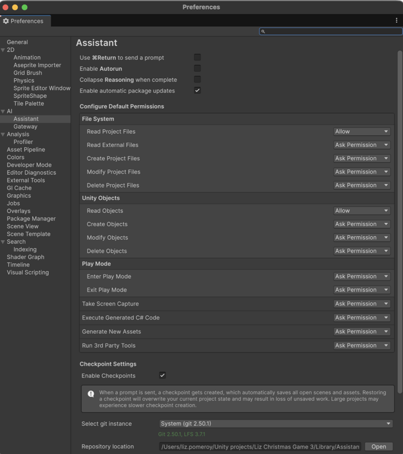
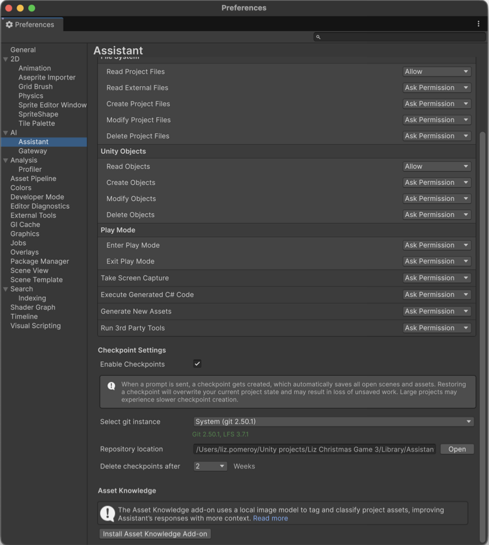

# Configure Assistant permissions and preferences

Define how you submit prompts, how Assistant requests permission, and how it displays reasoning during responses.

You can configure keyboard shortcuts for prompt submission, set permission levels for Assistant operations, enable Autorun, and control whether reasoning collapses automatically. These settings let you adapt Assistant behavior to your workflow and risk tolerance.

## Open Assistant preferences

To open the Assistant preferences, follow these steps:

1. Open the **Assistant** window.
2. Do one of the following:
   - **Windows**: Select **Edit > Preferences > AI > Assistant**.
   - **macOS**: Select **Unity > Settings > AI > Assistant**.

The Assistant preferences panel appears.

## Configure prompt submission

Use the **Ctrl**+**Enter** (macOS: **⌘Return**) option in Assistant to control how you submit prompts. It's useful when you work across different languages or workflows in which accidental prompt submissions can be  disruptive.

By default, when you press **Enter** (macOS: **⌘Return**), the prompt is immediately sent to Assistant. This can be inconvenient if you're writing a long prompt, multi-line text, or code block that requires formatting. If you enable the **Ctrl**+**Enter** (macOS: **⌘Return**) option, it ensures that prompts are only sent to Assistant when you use the full key combination.

To enable modified submission:

1. In the Assistant preferences, enable the following:
   - **Windows**: **Use Ctrl+Enter to send a prompt**
   - **macOS**: **Use ⌘Return to send a prompt**
2. Submit prompts with **Ctrl+Enter** (macOS: **⌘Return**).

## Enable Autorun

Autorun controls whether Assistant bypasses confirmation prompts.

When Autorun is enabled:

- Operations set to **Allow** or **Ask Permission** run without confirmation.
- Operations set to **Deny** remain blocked.

Select **Enable Autorun** to prevent Assistant from asking you for permissions.

## Control reasoning display

Assistant displays a **Reasoning** section for each response that shows how it arrives at an answer. This section can be useful to learn, debug prompts, or understand why Assistant chose a specific action. However, it can also add visual noise when you only want to focus on the final result.

Use automatic collapse to keep the conversation clean while still keeping the reasoning available when you need it.

To collapse reasoning automatically, select **Collapse Reasoning when complete**. Assistant hides the **Reasoning** section after each response finishes.

## Manage Assistant updates

Assistant can automatically check for compatible package updates and notify you when a new version is available.

If you select **Enable automatic package updates**, the Unity Editor checks for newer versions of the Assistant package during startup. If it finds a compatible update for your current Unity version, Assistant displays a notification banner with update options.

The notification provides the following actions:

- **Update**: Updates Assistant to the latest compatible version.
- **Dismiss**: Hides the notification until the next Editor restart.
- **Don’t ask again**: Disables future update notifications and switches to manual updates.

If you disable **Enable automatic package updates**, Assistant no longer checks for updates automatically. You can still update the package manually through the Package Manager. For more information, refer to [The Package Manager window](https://docs.unity3d.com/6000.3/Documentation/Manual/upm-ui.html).

> [!NOTE]
> Assistant only prompts you about updates that are compatible with your installed Unity Editor version.

## Configure permission levels

Each Assistant operation has one of three permission states:

- **Allow**: Assistant performs the operation without asking.
- **Ask Permission**: Assistant requests approval before each operation.
- **Deny**: Assistant blocks the operation without prompting.

To update a permission:

1. Locate an operation in the **Permissions** list.
2. From the dropdown menu next to the operation, select **Allow**, **Ask Permission**, or **Deny**.

## Configure checkpoints

The Assistant preferences include a **Checkpoint Settings** section where you can enable checkpoints and configure how Unity stores and retains checkpoint data.

For more information about these settings, refer to [Checkpoints reference](xref:checkpoints-reference).

## Enable Asset Knowledge

Assistant uses **Asset Knowledge** to understand the visual content of certain assets in your project, not just their file names. When you enable **Asset Knowledge**, Assistant creates local artificial intelligence (AI) embeddings for supported assets to retrieve accurate context when you ask questions.

For example, if your project contains an image named `image_1.png` that visually represents a tree, Assistant can still identify it as a tree even though the file name doesn’t describe it.

Without **Asset Knowledge**, Assistant can only search assets by name. With **Asset Knowledge**, it can also search by what the asset looks like.

**Asset Knowledge** supports texture, material, and GameObject asset types.

To use **Asset Knowledge**, follow these steps:

1. In the Assistant preferences, locate the **Asset Knowledge** section.
2. Select **Install Asset Knowledge Add-on** > **Enable Asset Knowledge**.
3. When prompted, select **Yes** to install the Sentis package.
   Unity recompiles the project and creates embeddings for supported assets in the background.

> [!NOTE]
> Sentis is a required dependency for **Asset Knowledge**. If you decline the Sentis installation, **Asset Knowledge** remains disabled. If you don’t need **Asset Knowledge** for a specific build, you can remove Sentis before building. **Asset Knowledge** will be temporarily disabled, but you can reinstall Sentis later to re-enable **Asset Knowledge**

> [!NOTE]
> **Asset Knowledge** runs entirely on your local machine. Assistant doesn't send any project assets to the cloud.

## Additional resources

* [Use prompt settings menu](xref:prompt-settings)
* [Enable tooltips in Play mode](xref:tooltip)