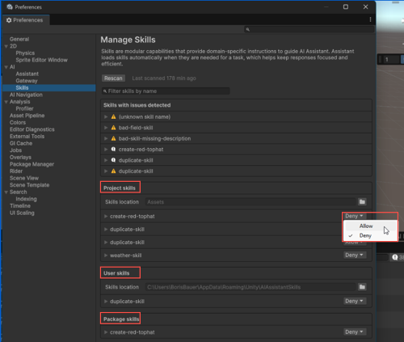
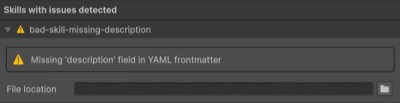
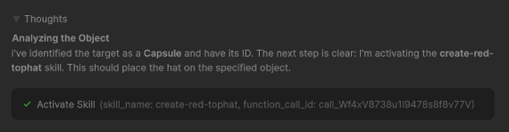

# Test and validate skills

Confirm that Assistant discovers skills, parses them correctly, and activates them in conversations.

After you create a local skill, you can inspect it in the Unity Editor to verify that Assistant found it and parsed it successfully.

You can also confirm whether a skill activates during a conversation. When Assistant invokes a skill as part of its reasoning and actions, the Assistant conversation area shows the activation in the **Thoughts** section. This confirms that a skill is both loaded and used.

## Prerequisites

Before you start, make sure you meet the following prerequisites:

1. Install and set up [Assistant](xref:install-assistant).
2. [Create a local skill](xref:skills-filesystem) in a scanned location.

## Open the skills settings

To access the skills settings, in the Unity Editor, select **Edit** > **Project Settings** > **AI** > **Skills**.

For more information on the **Manage Skills** page, refer to [Manage Skills page reference](xref:skills-reference).

## Review loaded skill information

Use the **Manage Skills** page in **Project Settings** to verify that Assistant discovered your skills in the expected locations and reported their current status correctly.

The **Manage Skills** page groups the discovered skills into **Project skills** and **User skills**, and also lists skills with parsing or validation problems under **Skills with issues detected**.

### Review discovered skills

To review discovered skills:

1. On the **Manage Skills** page, review the following groups:

   - **Project skills** for skills discovered in your current project.
   - **User skills** for skills stored in the user-level skills location on your device. You can share these skills across projects but they're only available on the device where they're stored.

      If the user-level skills folder doesn't exist yet, in the **User skills** section, select **Create user skills folder** to create an empty folder for user-level skills.

2. Confirm that the **Skills location** field matches the folder you expect Assistant to scan.
3. Expand a skill entry to review it.
4. Check whether the skill is active or is marked as **Disabled**.

   

### Review skills with issues

To review skills that failed validation or parsing:

1. Review the **Skills with issues detected** group.
2. Expand the affected skill entry to read the issue message.
3. Check the **File location** field to find the skill file that needs correction.
4. Correct the skill file and select **Rescan**.

   

Issues can include:

- Empty skill files.
- Missing mandatory fields in the YAML frontmatter header, such as `name` or `description`.
- Incorrect YAML frontmatter formatting, such as missing `---`.

### Filter or rescan skills

To refresh or narrow the list of displayed skills:

1. Use **Filter skills by name** to search for a specific skill.
2. Select **Rescan** to scan the configured locations again and refresh the results.
3. Review the **Last scanned** information to confirm when the most recent scan occurred.

If a skill appears on the **Manage Skills** page, it confirms that Assistant discovered it in a scanned location. If the skill appears under **Skills with issues detected**, Assistant found the file but might not use it successfully until you correct the reported problem.

## Confirm skill activation in Assistant

Skill activation means that Assistant invokes a skill as part of its reasoning and actions.

To confirm that a skill activates:

1. Enter a prompt in Assistant to trigger the skill. For example, ask about the skill's content or referenced resources.
2. Check that the Assistant conversation area shows **Activate Skill** and a `skill_name` parameter with your skill's name.

   

This confirms that Assistant selected the skill during the conversation.

> [!IMPORTANT]
> If you add or modify a skill, start a new Assistant conversation before you test it. Assistant sends the full skill definition to the model only when you submit the first prompt in a new conversation, so changes to a skill will not take effect in an existing conversation.

After you verify that the skill loads and activates, you can refine the instructions, supporting files, or static utility function references that the skill uses.

## Additional resources

* [Use static utility functions in skills](xref:static-utility-functions)
* [Manage Skills page reference](xref:skills-reference)